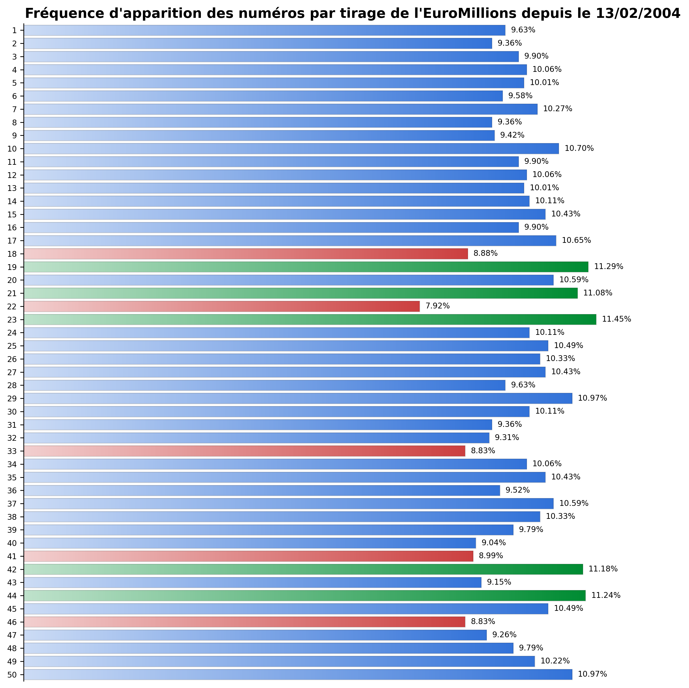

# EuroMillions – Analyse des fréquences de tirage  

Un Français a récemment remporté 250 millions d’euros à l’EuroMillions.  
Ce projet part de ce fait d’actualité pour illustrer ce que peut apporter une démarche analytique rigoureuse sur des données publiques.  

---

## Objectifs du projet  

- Mettre en place une **chaîne de traitement des données** de bout en bout  
- Illustrer les étapes clés : collecte, nettoyage, structuration, analyse et visualisation  
- Développer des compétences en **qualité de la donnée** et en **dataviz**  

---

## Structure du projet  

- **raw/** : fichiers bruts téléchargés (archives FDJ)  
- **silver/** : données nettoyées et standardisées (dates, encodage, types numériques)  
- **gold/** : dataset consolidé, prêt pour l’analyse et la visualisation  
- **data_analysis.py** : code Python pour automatiser nettoyage et analyse  
- ***.png** : graphiques finaux au format carré, adaptés aux réseaux sociaux  

---

## Compétences développées  

- **Data cleaning avancé** : gestion des formats de date, encodage, doublons, valeurs manquantes  
- **Structuration de la donnée** : mise en place d’un modèle simple raw / silver / gold  
- **Manipulation de données** : usage de pandas pour filtrer, agréger et valider la cohérence des résultats  
- **Visualisation** : création de graphiques clairs et professionnels (dégradés, format carré pour LinkedIn)  
- **Communication data** : vulgarisation des résultats pour un public non technique (post LinkedIn)  

---

## Résultat visuel  

---

## Pour en savoir plus  

[📌 Retrouvez l’analyse complète et le récit autour du projet sur mon LinkedIn](https://www.linkedin.com/in/pierrick-g-4721a2190/)
